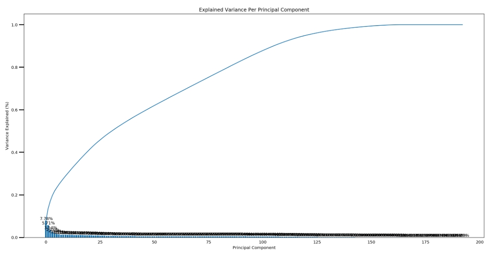
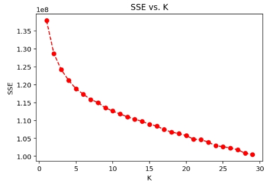
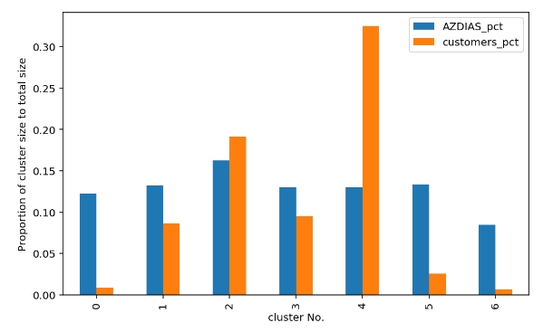

# Identify Customer Segmentation

[Table of Contents](#Table_of_Contents)
- [Introduction](#)
- [Data](#Data)
- [Installation](#Installation)
- [Summary of Analysis](#Summary-of-Analysis)
- [Acknowledgements](#)

## Introduction
The goal of this project is to help a mail-order sales company in Germany to identify segments of the population that form the core customer base. These segments can then be used to direct marketing campaigns towards audiences that should bring high expected returns.

The detailed code is in the **[`Identify_Customer_Segments.ipynb`](https://github.com/ustcdj/Identify_Customer_Segmentation/blob/master/Identify_Customer_Segments.ipynb)** notebook.

## Data
The data was provided by Bertelsmann Arvato Analytics. There are four files associated with this project):

- `Udacity_AZDIAS_Subset.csv`: Demographics data for the general population of Germany; 891211 persons (rows) x 85 features (columns).
- `Udacity_CUSTOMERS_Subset.csv`: Demographics data for customers of a mail-order company; 191652 persons (rows) x 85 features (columns).
- `Data_Dictionary.md`: Detailed information file about the features in the provided datasets.
- `AZDIAS_Feature_Summary.csv`: Summary of feature attributes for demographics data; 85 features (rows) x 4 columns

## Installation
The code was developed using the Anaconda distribution of Python, versions 3.8. Python libraries used are `pandas`, `numpy`, `sklearn`, `matplotlib`, `seaborn`

## Summary of Analysis

### 1. Preprocessing

#### 1.1 Missing data
- Drop columns with more than 20% missing or unkown values.
- Drop rows with 30 or more than 30 missing or unkown values.

#### 1.2 Categorical data
- For binary categorical features with numeric values, keep them with no change.
- For binary categorical features with non-numeric values, re-encode the values as numbers.
- For categorical features with three or more values, OneHotEncoder them
- For mixed-type features, separate into more features

### 2. Feature Transformation
- Impute NaN with the most frequent value for each feature.
- Apply StandardScaler to all features so that the principal component vectors are not influenced by the natural differences in scale for features.
- Perform dimensionality reduction - Use sklearn's PCA class to apply principal component analysis on the data plot the ratio of variance explained by each principal component as well as the cumulative variance explained.

  

The 1st principle component can explain 7.78% of the total variance, 2nd for 5.71%, 3rd for 3.54% and so on. To explain 90% variance, 105 principle components are needed.

Map weights for the first 3 principal component to corresponding feature names.
- The 1st principal component is related to financial, movement pattern, and number of 1-2 family houses in the PLZ8 region.
- The 2nd principal component is related to personal (age, generation, personality, energy consumption etc.) and financial.
- The 3rd principal component is related to personal (personality and Gender).

### 3. Apply Clustering to General Population
Use sklearn's KMeans class to perform k-means clustering on the PCA-transformed data and use scree plot to decide on 7 as the number of clusters to keep.

- Apply the same feature wrangling, selection, engineering, imputing, feature scaling steps to the customer demographics data. Then use PCA, and clustering from general population to obtain cluster assignments for all of the data in the customer demographics data.
- Compare customer clusters to general population clusters:
  - It is clear from the table above, cluster 2 and 4 are overrepresented in the customer data compared to the general population.
  - Cluster 0, 1, 3, and cluster 5 and 6 are underrepresented in the customer data compared to the general population.

I further looked into cluster 4 and 0, and found that:
Customers relatively popular with the mail-order company share some characters below,
- Top earners
- High estimated household net income
- High home ownership
- Having Membership in environmental sustainability as part of youth

Customers relatively unpopular with the mail-order company share some characters below,
- Low-income earners
- MINIMALIST with low financial interest
- Rational people
- Young people
- Non-dreamful people

## Acknowledgements
Special thanks to Bertelsmann Arvato Analytics for providing the dataset.
